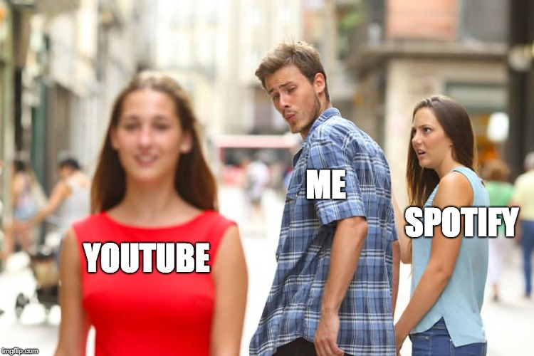
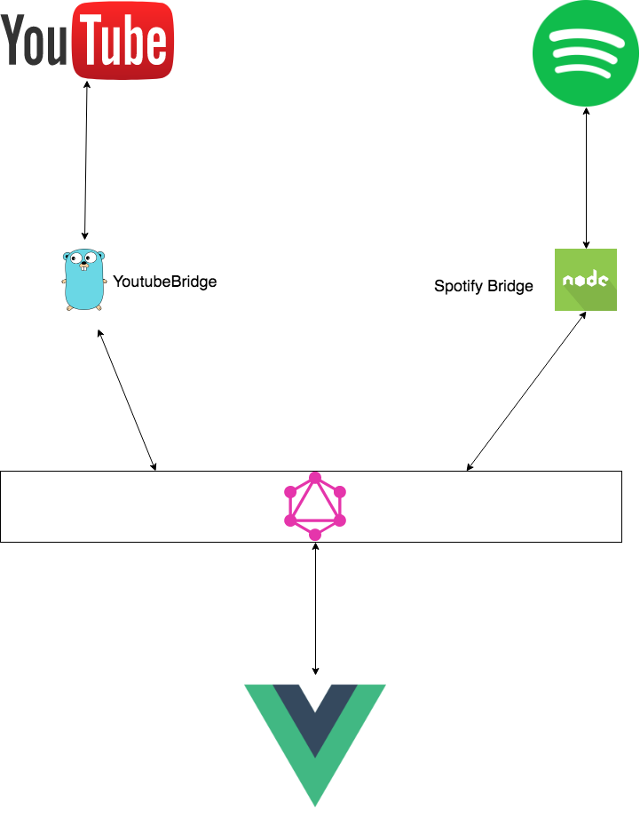

# MusicBridge
A collection of microservices to move music from one place to another, the original idea was to move Playlist from Spotify to Youtube, but it can easily be extended to go the other way around and / or add new providers.

## The original idea

When Youtube launched its premium plan I jumped on immediately, ads free youtube is heaven and it comes with musisc as well so it's a win win, the best part is Youtube's reccomendations engine, it's a state of the art piece of technology and deeply understands me.

## Architechture
A super simple diagram explains how it works

## Roadmap
Still in heavy development for an MVP the roadmap looks like this:
- [x] Spotify Bridge
- [ ] Youtube Bridge
- [x] GraphQL layer
- [ ] Vue FrontEnd

# Infx
Excluding various differen secrets, API keys and  config, all the microservices will be deployable on Google App Engine wiht a simple command, so anybody can run its own copy of the whole thing CI can be configured for autodeploy but it's not fun so it'll be one of the last things on the list.
